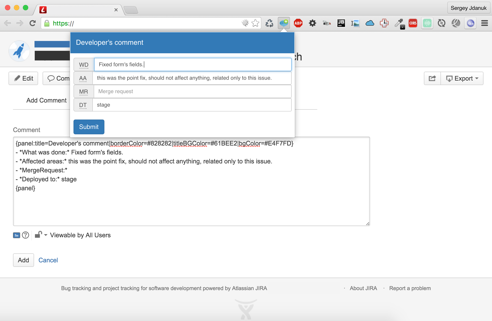

## Install

1. `git clone https://github.com/SergeyJdanuk/chrome-plugin-jira-developer-comment jdc-plugin`
2. `cd jdc-plugin`
3. `npm install`
4. `node_modules/.bin/bower install`
4. `node_modules/.bin/gulp` it will create a dist dir.
5. Open in chrome browser: Settings -> Extensions
6. Click "Load unpacked extension" button
7. Select "jdc-plugin/dist" dir